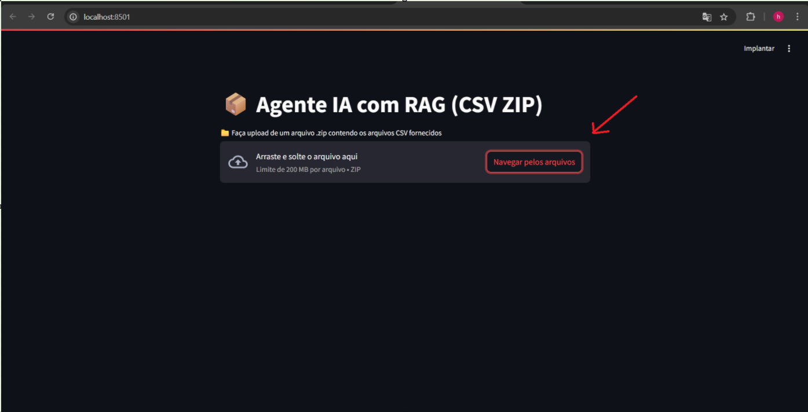
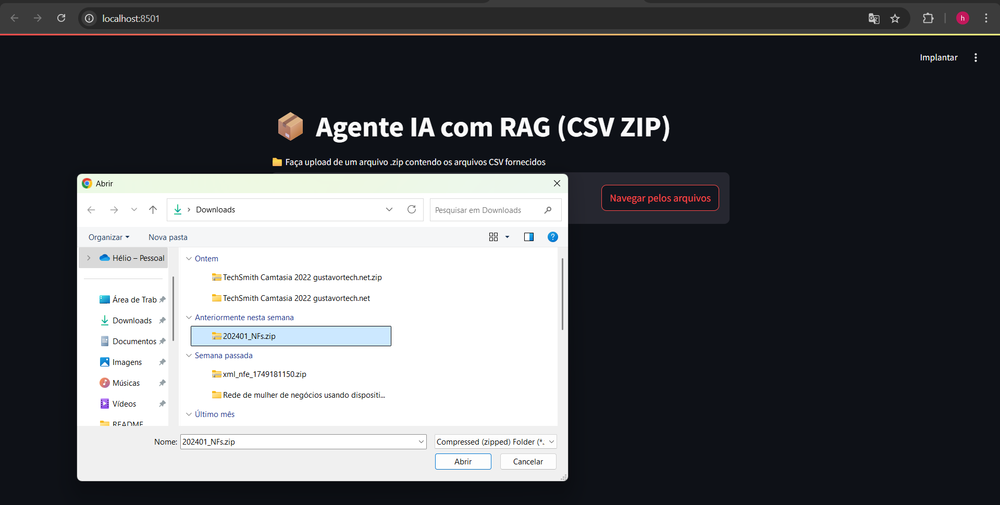
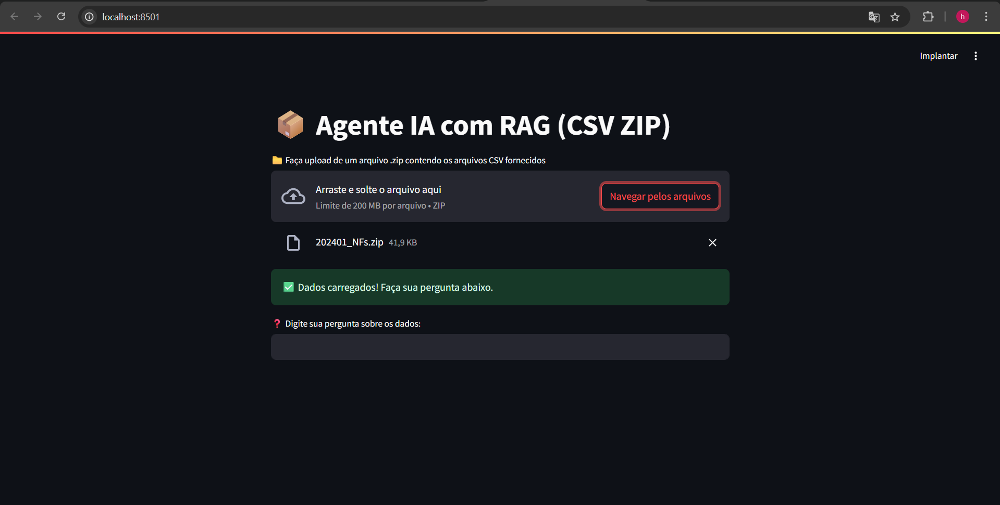
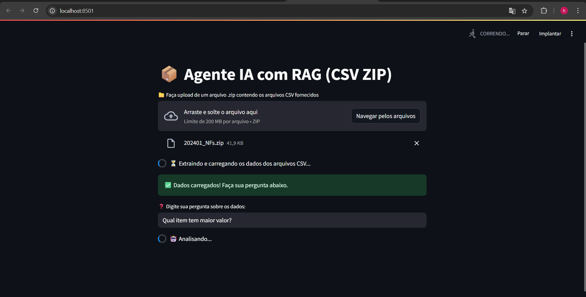
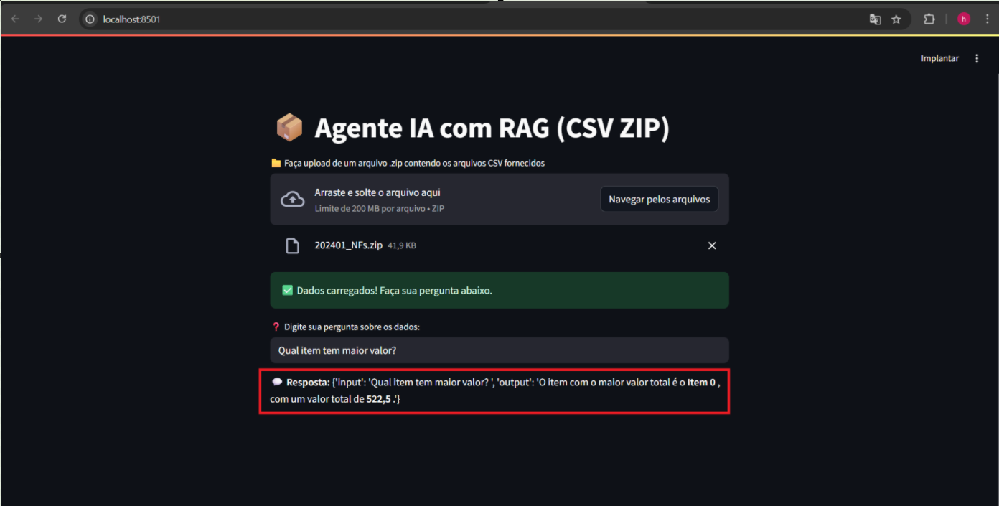

# 🤖 Agente IA com RAG para Análise de CSV (via ZIP)

Este projeto implementa um **Agente de IA baseado em RAG (Retrieval-Augmented Generation)**, permitindo a **análise de arquivos CSV compactados em um ZIP** por meio de uma interface amigável com **Streamlit**.

🚀 **Totalmente pronto para rodar via Docker!**

---

## 🧠 O que é RAG?

**Retrieval-Augmented Generation (RAG)** é uma abordagem que combina recuperação de documentos com geração de linguagem natural. Neste projeto, isso permite que a IA **leia e compreenda arquivos CSV** enviados pelo usuário, respondendo a perguntas com base nos dados fornecidos.

---

## 🗂️ Estrutura do Projeto

```
📦 agente-rag-csv
├── app.py                 # Interface principal com Streamlit
├── rag_agent.py          # Lógica do agente RAG
├── utils/
│   └── extract_zip.py    # Extração de arquivos ZIP
├── .streamlit/           # Configurações da interface
├── requirements.txt      # Dependências do Python
├── Dockerfile            # Dockerfile da aplicação
├── docker-compose.yml    # Configuração opcional via Docker Compose
└── README.md             # Este arquivo
```

---

## ⚙️ Instalação e Execução

### ✅ Pré-requisitos

Antes de começar, certifique-se de ter instalado:

- [Python 3.10+](https://www.python.org/)
- [Docker](https://www.docker.com/)
- [Docker Compose](https://docs.docker.com/compose/)
- [Git](https://git-scm.com/)

---

### 📦 Execução com Docker

```bash
# Clonar o repositório
git clone https://github.com/heliogald/Agentes-Aut-nomos-An-lise-de-CSV.git
cd Agentes-Aut-nomos-An-lise-de-CSV

# Criar o arquivo .env (ver seção abaixo)

# Construir e executar com Docker
docker build -t agente-rag .
docker run --env-file .env -p 8501:8501 agente-rag
```

💡 Ou utilizando Docker Compose:

```bash
docker-compose --env-file .env up --build
```

---

## 🧪 Executando Localmente (sem Docker)

```bash
# Ative o ambiente virtual
python -m venv .venv
source .venv/bin/activate  # Linux/Mac
.venv\Scripts\activate   # Windows

# Instale as dependências
pip install -r requirements.txt

# Criar o arquivo .env (ver abaixo)

# Inicie a aplicação
streamlit run app.py
```

---

## 🔐 Configuração do `.env`

Para utilizar o modelo de linguagem (LLM), você precisa fornecer uma chave de API. O projeto está integrado com o provedor [OpenRouter.ai](https://openrouter.ai), mas você pode usar qualquer provedor compatível com LangChain.

Crie um arquivo `.env` na raiz do projeto com:

```env
OPENROUTER_API_KEY=sua-chave-api-aqui
```

🔑 **Importante:** Crie sua chave gratuita ou paga em: [OpenRouter.ai](https://openrouter.ai)

---

## 🧠 Como Usar

1. Faça upload de um arquivo `.zip` contendo arquivos `.csv`.




2. O agente extrai os dados e os carrega automaticamente.



3. Digite sua pergunta em linguagem natural.



4. Receba a resposta baseada nos dados do CSV.



---

## 🛠 Tecnologias Utilizadas

- **Python** – Linguagem principal do projeto
- **Streamlit** – UI interativa
- **LangChain** – Pipeline RAG
- **Pandas** – Manipulação de CSVs
- **dotenv** – Variáveis de ambiente
- **Docker** – Contêiner da aplicação

---

## ❓ Suporte

Achou algum bug ou tem sugestões?  
📬 Crie uma issue ou entre em contato: [helio.galdino@gmail.com](mailto:helio.galdino@gmail.com)

---

## 📃 Licença

Este projeto está sob a licença **MIT**. Sinta-se à vontade para usar, modificar e distribuir.

---

> Happy Coding! 🚀
